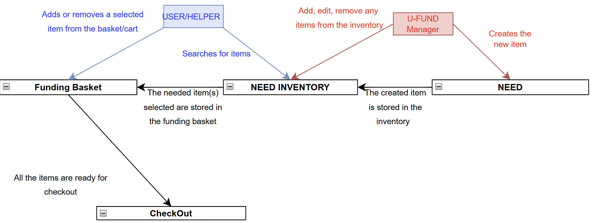

# PROJECT Design Documentation

> _The following template provides the headings for your Design
> Documentation.  As you edit each section make sure you remove these
> commentary 'blockquotes'; the lines that start with a > character
> and appear in the generated PDF in italics but do so only **after** all team members agree that the requirements for that section and current Sprint have been met. **Do not** delete future Sprint expectations._

## Team Information 
* Team name: Team 06 Fantastech4
* Team members
  * Nolan York
  * Tommy Bell
  * James Halt
  * Brayden Castro

## Executive Summary
This project is a web-based platform for managing school supplies and school supplies needs efficiently. It supports helpers by organizing and tracking items (Needs)
for through a centralized system. The goal is to streamline school supply allocation, prevent errors, and provide visibility into available and required supplies.

### Purpose
>  _**[Sprint 2 & 4]** Provide a very brief statement about the project and the most
> important user group and user goals._

The purpose of this project is to provide users wuth a centralized, and friendly to use application for managing school supplies allocation. The primary users, helpers,
can easily lorganize baskets for needed supplies, while the secondary users, admins, can monitor and validate activities. The system helps reduce manual tracking,
prevent errors, and makes communication between helpers and admins easier and quicker.

### Glossary and Acronyms
> _**[Sprint 2 & 4]** Provide a table of terms and acronyms._

| Term | Definition |
|------|------------|
| SPA | Single Page |
| REST | Representational State Transfer |
| MVP | Minimum Viable Product |
| Basket | A collection of Needs |
| Need | An item requested by a helper | 

## Requirements

This section describes the features of the application.

> _In this section you do not need to be exhaustive and list every
> story.  Focus on top-level features from the Vision document and
> maybe Epics and critical Stories._

### Definition of MVP
> _**[Sprint 2 & 4]** Provide a simple description of the Minimum Viable Product._
The MVP of this project:
1. User management
2. Creation, viewing, anf management of school supplies basket (Funding baskets)
3. Finalization to lock completed baskets. 
4. Interface that allows for smooth navigation and interaction. 

### MVP Features
>  _**[Sprint 4]** Provide a list of top-level Epics and/or Stories of the MVP._

### Enhancements
> _**[Sprint 4]** Describe what enhancements you have implemented for the project._

## Application Domain

This section describes the application domain.

> _**[Sprint 2 & 4]** Provide a high-level overview of the domain for this application. You
> can discuss the more important domain entities and their relationship
> to each other._

The main entities and relationships of the project:
1. Helper: Primary user, can manage their own basket and Needs.
2. Funding Basket: Group of needs asscoiated with a helper.
3. Need: Individual resource item with description, quantity, and other metadata.

## Architecture and Design

This section describes the application architecture.

### Summary

The following Tiers/Layers model shows a high-level view of the webapp's architecture. 
**NOTE**: detailed diagrams are required in later sections of this document.
> _**[Sprint 1]** (Augment this diagram with your **own** rendition and representations of sample system classes, placing them into the appropriate M/V/VM (orange rectangle) tier section. Focus on what is currently required to support **Sprint 1 - Demo requirements**. Make sure to describe your design choices in the corresponding _**Tier Section**_ and also in the _**OO Design Principles**_ section below.)_

The web application, is built using the Model–View–ViewModel (MVVM) architecture pattern. 

The Model stores the application data objects including any functionality to provide persistance. 

The View is the client-side SPA built with Angular utilizing HTML, CSS and TypeScript. The ViewModel provides RESTful APIs to the client (View) as well as any logic required to manipulate the data objects from the Model.

Both the ViewModel and Model are built using Java and Spring Framework. Details of the components within these tiers are supplied below.

### Overview of User Interface

This section describes the web interface and flow; this is how the user views and interacts with the web application.
>_For the reference below, provide an initial draft image/sketch of possible layout of a mayor page of your User Interface and a brief description of the elements it contains **[Sprint 1]**_

### 
> _Provide a summary of the application's user interface.  Describe, from the user's perspective, the flow of the pages/navigation in the web application.
>  (Add low-fidelity mockups prior to initiating your **[Sprint 2]**  work so you have a good idea of the user interactions.) Eventually replace with representative screen shots of your high-fidelity results as these become available and finally include future recommendations improvement recommendations for your **[Sprint 4]** )_

### View Tier
> _**[Sprint 4]** Provide a summary of the View Tier UI of your architecture.
> Describe the types of components in the tier and describe their
> responsibilities.  This should be a narrative description, i.e. it has
> a flow or "story line" that the reader can follow._

> _**[Sprint 4]** You must  provide at least **2 sequence diagrams** as is relevant to a particular aspects 
> of the design that you are describing.  (**For example**, in a shopping experience application you might create a 
> sequence diagram of a customer searching for an item and adding to their cart.)
> As these can span multiple tiers, be sure to include an relevant HTTP requests from the client-side to the server-side 
> to help illustrate the end-to-end flow._

> _**[Sprint 4]** To adequately show your system, you will need to present the **class diagrams** where relevant in your design. Some additional tips:_
 >* _Class diagrams only apply to the **ViewModel** and **Model** Tier_
>* _A single class diagram of the entire system will not be effective. You may start with one, but will be need to break it down into smaller sections to account for requirements of each of the Tier static models below._
 >* _Correct labeling of relationships with proper notation for the relationship type, multiplicities, and navigation information will be important._
 >* _Include other details such as attributes and method signatures that you think are needed to support the level of detail in your discussion._

### ViewModel Tier
> _**[Sprint 1]** List the classes supporting this tier and provide a description of there purpose._

> _**[Sprint 4]** Provide a summary of this tier of your architecture. This
> section will follow the same instructions that are given for the View
> Tier above._

> _At appropriate places as part of this narrative provide **one** or more updated and **properly labeled**
> static models (UML class diagrams) with some details such as associations (connections) between classes, and critical attributes and methods. (**Be sure** to revisit the Static **UML Review Sheet** to ensure your class diagrams are using correct format and syntax.)_
> 

### Model Tier
> _**[Sprint 1]** List the classes supporting this tier and provide a description of there purpose._

> _**[Sprint 2, 3 & 4]** Provide a summary of this tier of your architecture. This
> section will follow the same instructions that are given for the View
> Tier above._
Core classes:
  Authenticator
  Cupboard
  DashboardStats
  Need
  User

> _At appropriate places as part of this narrative provide **one** or more updated and **properly labeled**
> static models (UML class diagrams) with some details such as associations (connections) between classes, and critical attributes and methods. (**Be sure** to revisit the Static **UML Review Sheet** to ensure your class diagrams are using correct format and syntax.)_
> 

## OO Design Principles

> _**[Sprint 1]** Name and describe the initial OO Principles that your team has considered in support of your design (and implementation) for this first Sprint._

> _**[Sprint 2, 3 & 4]** Will eventually address upto **4 key OO Principles** in your final design. Follow guidance in augmenting those completed in previous Sprints as indicated to you by instructor. Be sure to include any diagrams (or clearly refer to ones elsewhere in your Tier sections above) to support your claims._
> _**[Sprint 3 & 4]** OO Design Principles should span across **all tiers.**_

1. Separation of Conserns (SoC)
    Each layer of our projects architecture has a distinct role.
      Model: Handles data and business logic (Ex: Cupboard, Item, NotifictionService)
      Controller/ViewModel: Communicates between the frontend and backend, processing user input and organzing updates.
      View/UFund-UI: Displays data to the user (Ex: Angular components like cupboard.component.ts)
    This seperation od concerns allows each tier of the arhitecture to be modified independently without affecting others.

    Answer from Sprint 2:
    Front-End  
      All user interaction and request handling logic is isolocated in the REST controllers. This tier only formats requests/responses and doesn't directly access the business like logic or data persistence.
    Business Logic
      Contrains all core application logic, such as validations.
    Data Access (DAO)
      Responsible solely for CRUD operations and persistence. Handle reading/writing to JSON files. These files are unaware of how the data is used in business logic.

2. Single Responsibility Principle (SRP)
    Each class has a it's own clear purpose:
      For example, the Controller Classes:
        CupboardController only handles HTTP requests related to cupboards.
        Notification Controller is soley responsible for managing notification data.
        NotificationService is responsible for sending notifications between the backend and frontend.
      DAO classes:
        Each DAO handles data for a single entity. If the strategy of storing data changes, only this classs needs to be updated.

3. Low Coupling
    Each service and controlller only interacts through clear itnerfaces (REST endpoints).
    For example: The NotificationService doesn't directly modify any controllers state. It only makes HTTP requests, so changing its implementation will not break other classes.
    This design principle allows out classes to be cohesive but still loosely connected.

## Static Code Analysis/Future Design Improvements
> _**[Sprint 4]** With the results from the Static Code Analysis exercise, 
> **Identify 3-4** areas within your code that have been flagged by the Static Code 
> Analysis Tool (SonarQube) and provide your analysis and recommendations.  
> Include any relevant screenshot(s) with each area._

> _**[Sprint 4]** Discuss **future** refactoring and other design improvements your team would explore if the team had additional time._

## Testing
> _This section will provide information about the testing performed
> and the results of the testing._

### Acceptance Testing
> _**[Sprint 2 & 4]** Report on the number of user stories that have passed all their
> acceptance criteria tests, the number that have some acceptance
> criteria tests failing, and the number of user stories that
> have not had any testing yet. Highlight the issues found during
> acceptance testing and if there are any concerns._

View the Acceptance Test Plan document for more information.

### Unit Testing and Code Coverage
> _**[Sprint 4]** Discuss your unit testing strategy. Report on the code coverage
> achieved from unit testing of the code base. Discuss the team's
> coverage targets, why you selected those values, and how well your
> code coverage met your targets._

>_**[Sprint 2, 3 & 4]** **Include images of your code coverage report.** If there are any anomalies, discuss
> those._
(___.png)

## Ongoing Rationale
>_**[Sprint 1, 2, 3 & 4]** Throughout the project, provide a time stamp **(yyyy/mm/dd): Sprint # and description** of any _**mayor**_ team decisions or design milestones/changes and corresponding justification._

Mainly on Slack

(2025/10/10) Sprint 2: Working on now:
Tommy: Edit needs in Cupboard, Search needs in cupboard user stories
James: Admin logic, modify funding basket user stories
Nolan: Refactoring, Populate/remove/browse needs in cupboard user stories
Brayden: Checkout needs to funding basket, edit needs in cupboard user stories
Working on next:
Tommy: User stories in progress
James: Researching, User stories in progress
Nolan: User stories that are in progress
Brayden: User stories that are in progress
BLOCKERS:
Tommy: N/A
James: Funding basket creation
Nolan: Need to refactor before everyone continues
Brayden: Funding basket creation

(2025/11/07) Sprint 3: 
Working on now:
ALL: Sorting out bugs from all the merges
Working on next:
ALL: Testing and code coverage
BLOCKERS:
Tommy: N/A
James: Filter for basket
Nolan: N/A
Brayden: N/A
During Standup:
Merged all our separate feature branches to sprint3-dev
Worked on fixing merge conflicts and bugs that arose
Discussed plan moving forward

